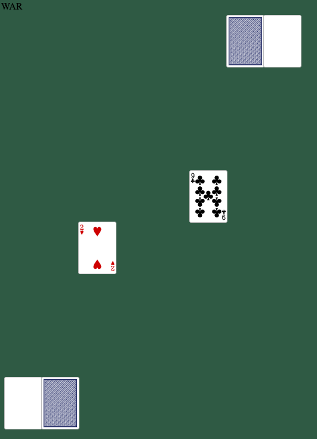

<<<<<<< HEAD
# War
=======
## War
>>>>>>> aee9ff2aaa2e4a144bd29761b0db6c833d0531eb

## Object of the Game

Take all of your opponent's cards.

## Gameplay

### Taking a Turn

The top card of each player's deck is revealed by clicking on the deck near the the bottom of the window.

The cards are sent to the winning player's discard pile by clicking on the discard pile to the left of the deck. (Both discard piles appear as white spaces until its player has a victory. Then it appears as the most recently won card.)

### War

In the event of a tie, click the card the was played by clicking on the deck to reveal the cards that will be involved in the war chain. Then click on the card to the upper-right of the deck to send all the cards to the winner of the war.

### Victory

Victory will be declared for the first player to have all fifty-four cards in their deck.

# Screenshot

<<<<<<< HEAD
;

# Technologies Used
=======
## Screenshot

;

## Technologies Used
>>>>>>> aee9ff2aaa2e4a144bd29761b0db6c833d0531eb

HTML
CSS
JavaScript

<<<<<<< HEAD
# Getting Started

http://michaelsbaldanza.github.io/project-one-war

# Next Steps
=======
## Getting Started

http://michaelsbaldanza.github.io/project-one-war

## Next Steps
>>>>>>> aee9ff2aaa2e4a144bd29761b0db6c833d0531eb

Create winning conditions for ties to at least the fifth order.
Improve styling. Add card counter, card animation, adjust board position on-screen, add more interesting background, move-by-move narration, eye-catching header.